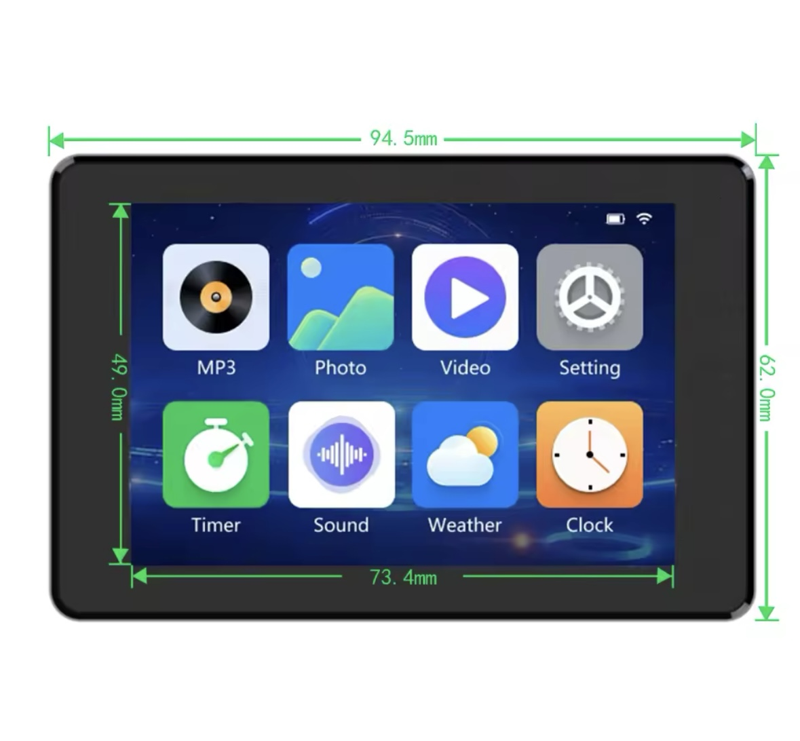
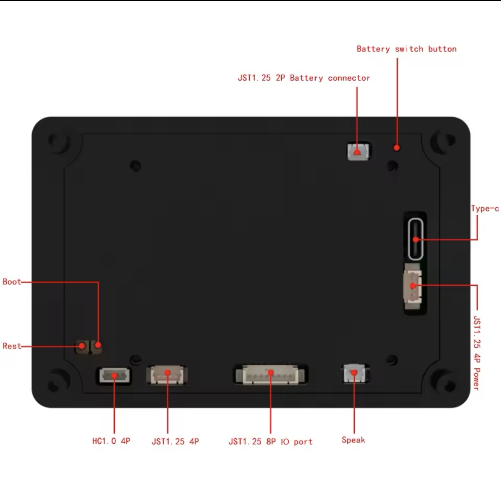

# This is a platformio based build of the JC3248W535EN DEMO_LVGL Package

I had downloaded the zip file from the manufacturer, but had a really hard time getting it to build in VSCode/PlatformIO so I thought I would share my build to help others get started with the board.

Under the covers, this build leverages ESP-IDF 5.3 and LVGL 8.3.  I found that it would not build on Arduino ESP32, as the display code required ESP-IDF (5.3.0) in order to complile.  And Arduino ESP32 is currently ESP-IDF 4.x

For this board from https://s.click.aliexpress.com/e/_DFO5uIV